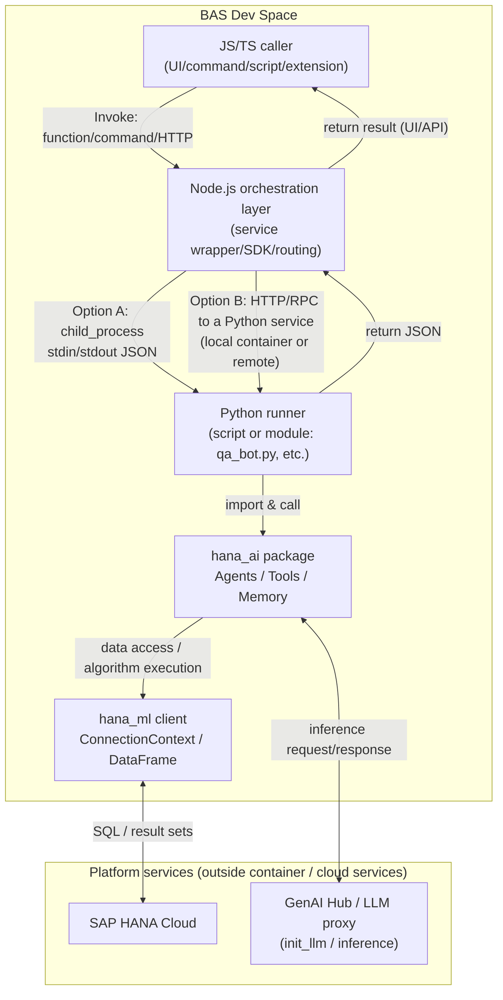

## Architecture (Mermaid)

```mermaid
%%{init: {"themeVariables": {"fontSize": "20px"}, "flowchart": {"nodeSpacing": 50, "rankSpacing": 60}}}%%
flowchart TB
  subgraph BAS["BAS Dev Space "]
    direction TB
    UI["JS/TS caller\n(UI/command/script/extension)"]
    NODE["Node.js orchestration layer\n(service wrapper/SDK/routing)"]
    PY["Python runner\n(script or module: qa_bot.py, etc.)"]
    HAAI["hana_ai package\nAgents / Tools / Memory"]
    HML["hana_ml client\nConnectionContext / DataFrame"]
  end

  subgraph Platform["Platform services (outside container / cloud services)"]
    direction TB
    HANA["SAP HANA Cloud"]
    LLM["GenAI Hub / LLM proxy\n(init_llm / inference)"]
  end

  UI -->|"Invoke: function/command/HTTP"| NODE

  NODE -->|"Option A: child_process\nstdin/stdout JSON"| PY
  NODE -->|"Option B: HTTP/RPC to a Python service\n(local container or remote)"| PY

  PY -->|"import & call"| HAAI
  HAAI -->|"data access / algorithm execution"| HML
  HML <-->|"SQL / result sets"| HANA

  HAAI <-->|"inference request/response"| LLM

  PY -->|"return JSON"| NODE
  NODE -->|"return result (UI/API)"| UI
```
