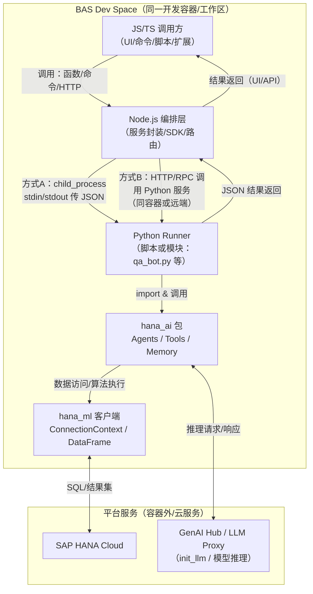
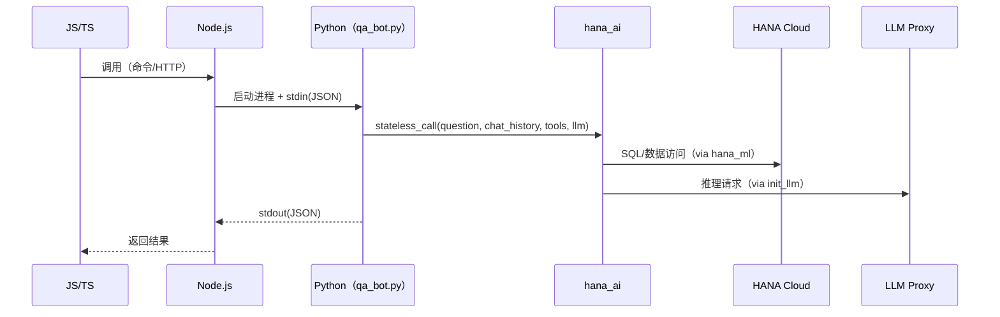

# BAS 通过 JS 调用 hana_ai（Python）——概念架构图

> 目的：用框架/概念层面说明在 SAP Business Application Studio（BAS）中，JS/Node 如何驱动 Python（`hana_ai`）完成对 HANA 与大模型的访问。

## 图例（Legend）

- 方框：组件/运行时/模块
- 实线箭头 `-->`：调用/数据流方向
- 箭头标签：协议或传输方式（`HTTP` / `stdin&stdout(JSON)` / `SQL` 等）
- 分组（subgraph）：部署边界（BAS 容器内 vs 外部服务）

## 架构图（Mermaid）

## 最小链路（贴近 qa_bot.py 的常见落地）

